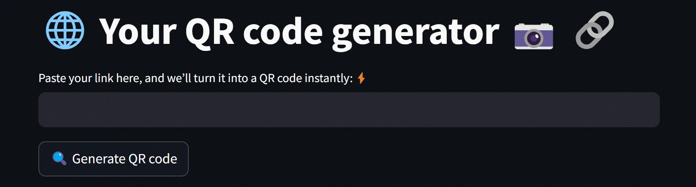

# 🔗 QR code generator 📷 | 🐍 Python 🔳
"Turn any web link into a QR code with this easy tool! Built using Python, QR Code libraries and Streamlit.
Scan the code with your phone to quickly open the link. Fast, simple, and clean design."

## 🚀 Features

- 🌐 A web-based QR code generator
- 🧠 Clean and user-friendly interface
- 🎨 Cool hover effects and emoji-enhanced UI
- 📷 QR code generation using `qrcode` and `Pillow`
- 📥 Downloadable QR codes as JPEG file
- 💻 Fully open-source and hosted on [Streamlit Cloud](https://streamlit.io/cloud)

---

## 🖼️ Live Demo

👉 [Launch the App](https://live-qr-code-generator-app.streamlit.app)

## 📦 Tech Stack

- [Streamlit](https://streamlit.io/)
- [qrcode](https://pypi.org/project/qrcode/)
- [Pillow](https://pypi.org/project/Pillow/)

---

## 🛠️ How to Run Locally

1. Clone the repo:
  git clone https://github.com/inform2sajin/live-qr-code-generator-app.git
  cd qr-code-generator
  Install dependencies: """
3. Clone the repo:
   pip install -r requirements.txt
4. Run the app:
   streamlit run qrgenerator.py

   
🧑‍💻 Made with ❤️ by Sajin KP

